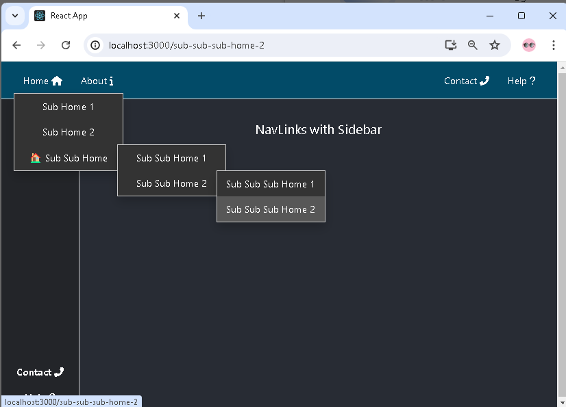

# Getting Started with `asafarim-navlinks`

`asafarim-navlinks` is a versatile React component for rendering navigation link items, including support for multi-level dropdown menus, icons, and emojis. This package helps in creating dynamic and stylish navigation bars for your React applications.


`asafarim-navlinks` as a comprehensive Multi-Level Navigation Links for React

## Installation

To install the package via npm, run the following command:

```sh
npm install asafarim-navlinks
```

## Usage

Here's a step-by-step guide on how to use the `asafarim-navlinks` component in your React TypeScript application.

### Step 1: Import the Component

Import the `NavLinks` component into your React application:

```tsx
import React from 'react';
import NavLinks from 'asafarim-navlinks';
```

### Step 2: Prepare the Links Data

Create an array of link objects that you want to render. Each link can optionally contain sub-navigation items, icons, and emojis.

**src/data.ts:**

```tsx
type NavLinkType = {
  label: string;
  href: string;
  iconLeft?: string;
  iconRight?: string;
  emoji?: string;
  subNav?: NavLinkType[];
}

export const navItems = {
    leftAlignedNavItems: [
      {
        label: "Home",
        href: "/",
        iconRight: "fas fa-home",
        subNav: [
          {
            label: "Mainpage",
            href: "/mainpage",
            icon: "fas fa-home-1",
            subNav: [
              { label: "Show Home", href: "/mainpage" },
              { label: "Sub Sub Home 2", href: "/sub-sub-home-2" },
            ],
          },
          { label: "Sub Home 2", href: "/sub-home-2" },
          {
            label: "Sub Sub Home",
            href: "/sub-sub-home",
            emoji: "🏠 ",
            subNav: [
              { label: "Sub Sub Home 1", href: "/sub-sub-home-1" },
              {
                label: "Sub Sub Home 2",
                href: "/sub-sub-home-2",
                subNav: [
                  { label: "Sub Sub Sub Home 1", href: "/sub-sub-sub-home-1" },
                  { label: "Sub Sub Sub Home 2", href: "/sub-sub-sub-home-2" },
                ],
              },
            ],
          },
        ],
      },
      { label: "About", href: "/about", iconRight: "fas fa-info" },
    ] as NavLinkType[],
    middleAlignedNavItems: [
      {
        label: "Services",
        href: "/services",
        iconRight: "fas fa-tools",
        subNav: [
          { label: "Service 1", href: "/services" },
          {
            label: "Service 2",
            href: "/service-2",
            subNav: [
              { label: "Sub Service 1", href: "/sub-service-1" },
              { label: "Sub Service 2", href: "/sub-service-2" },
            ],
          },
          {
            label: "Service 3",
            href: "/service-3",
            subNav: [
              { label: "Sub Service 1", href: "/sub-service-1" },
              { label: "Sub Service 2", href: "/sub-service-2" },
            ],
          },
        ],
      },
      { label: "Products", href: "/products", iconRight: "fas fa-boxes" },
    ],
    rightAlignedNavItems: [
      {
        label: "Contact",
        href: "/contact",
        iconRight: "fas fa-phone-alt",
        subNav: [
          { label: "Email", href: "/email" },
          { label: "Contacts", href: "/contact" },
          {
            label: "Phone",
            href: "/phone",
            subNav: [
              { label: "Phone Landline 1", href: "/phone-landline-1" },
              { label: "Phone Landline 2", href: "/phone-landline-2" },
              {
                label: "Phone Mobile",
                href: "/phone-mobile",
                iconLeft: "fas fa-mobile-alt",
                subNav: [
                  { label: "Phone Mobile 1", href: "/phone-mobile-1" },
                  { label: "Phone Mobile 2", href: "/phone-mobile-2", emoji: "📱" },
                ],
              },
            ],
          },
          { label: "About", href: "/about" },
        ],
      },
      { label: "Help", href: "/help", iconRight: "fas fa-question" },
    ] as NavLinkType[],
  };
```

### Step 3: Render the Component

Use the `NavLinks` component in your JSX and pass the links array as a prop.

**src/App.tsx:**

```tsx
import React from "react";
import { Route, Routes } from "react-router-dom";
import NavLinks from "asafarim-navlinks";
import { navItems } from "./data";
import "./App.css";

const Home: React.FC = () => <h2>Home Page</h2>;
const About: React.FC = () => <h2>About Page</h2>;
const Services: React.FC = () => <h2>Services Page</h2>;
const Products: React.FC = () => <h2>Products Page</h2>;
const Contact: React.FC = () => <h2>Contact Page</h2>;
const Help: React.FC = () => <h2>Help Page</h2>;
const NotFound: React.FC = () => <div>
  <h2>Page Not Found</h2>
  <p>The page you are looking for does not exist.</p>
  <p>Please check the URL and try again.</p>

  Go to <a href="/">Home</a>
</div>;

const App: React.FC = () => {
  return (
    <div className="App">
      <nav className="navContainer">
        <div className="navLeftAligned">
          <NavLinks links={navItems.leftAlignedNavItems} />
        </div>
        <div className="navRightAligned">
          <NavLinks
            links={navItems.rightAlignedNavItems}
            isRightAligned={true}
          />
        </div>
      </nav>
      <main className="mainContainer">
        <h1>Navigation Links Demo</h1>
        <Routes>
          <Route path="/" element={<Home />} />
          <Route path="/mainpage" element={<Home />} />
          <Route path="/about" element={<About />} />
          <Route path="/services" element={<Services />} />
          <Route path="/products" element={<Products />} />
          <Route path="/contact" element={<Contact />} />
          <Route path="/help" element={<Help />} />
          <Route path="*" element={<NotFound />} />
        </Routes>
      </main>
    </div>
  );
};

export default App;

```

### Step 4: Styles

Ensure your styles are set up to handle the navigation layout.

**src/App.css:**

```css
.App {
  text-align: center;
  height: 100vh;
  background-color: #282c34;
  color: white;
}

.navContainer {
  display: flex;
  justify-content: space-between;
  padding: 1rem;
  background-color: rgb(2, 75, 104);
}

.navLeftAligned, .navRightAligned {
  display: flex;
  align-items: center;
}

.mainContainer {
  padding: 2rem;
}
```

### Full Example

Here’s a full example of how to integrate `asafarim-navlinks` into a React TypeScript project, including multi-level dropdown menus, icons, and emojis.

**src/index.tsx:**

```tsx
import React from 'react';
import ReactDOM from 'react-dom';
import App from './App';
import './index.css';

ReactDOM.render(<App />, document.getElementById('root'));
```

### Development

To contribute to this package, follow these steps:

1. Clone the repository.
2. Install the dependencies:

   ```sh
   npm install
   ```

3. Make your changes.
4. Build the package:

   ```sh
   npm run build
   ```

5. Publish the package:

   ```sh
   npm publish --access public
   ```

### License

[MIT License](LICENSE)
